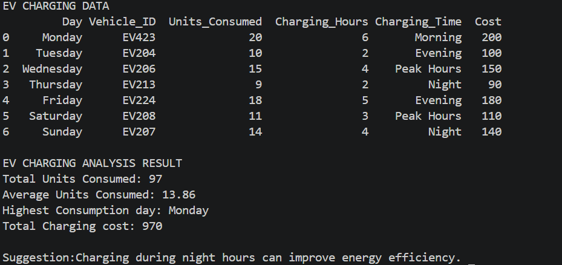

# Smart EV Charging Analysis System

## About
Smart EV Charging Analysis System is a Python-based data analysis project designed to study Electric Vehicle (EV) charging behavior using a structured CSV dataset. The system analyzes energy consumption, charging duration, cost patterns, and usage trends to generate meaningful insights. The main objective of this project is to understand how EV charging varies across different days and time periods and to provide simple suggestions for improving energy efficiency based on data analysis. This project demonstrates fundamental data analysis concepts using Python and pandas by reading datasets, performing calculations, and extracting useful insights.

---

## Technologies Used
- Python
- Pandas
- CSV Data Handling

---

## Libraries Used
- pandas

---

## How to Run

1. Install pandas library:
   pip install pandas

2. Run the program:
   python main.py

3. The output will be displayed in the terminal.

---

## Working
The system reads EV charging data from `data.csv` and performs the following analysis:

- Calculates total energy consumption
- Finds average units consumed
- Identifies the highest consumption day
- Computes total charging cost
- Analyzes charging patterns across different time slots
- Provides simple efficiency suggestions based on usage patterns

---

## Dataset Description
The dataset (`data.csv`) contains the following fields:

- Day of the week
- Vehicle ID
- Units Consumed
- Charging Hours
- Charging Time (Morning / Evening / Night / Peak Hours)
- Cost of charging

---

## Screenshots

### Output

---

## Future Improvements
- Add data visualization using graphs (matplotlib)
- Improve analysis with predictive models
- Compare multiple EV vehicles
- Build interactive dashboard for analysis
- Expand dataset for real-world scale insights

---

## Project Status
Currently a Python-based local data analysis project that processes EV charging data and generates insights for understanding energy usage patterns.

---

## Author
Badarla Lihesh